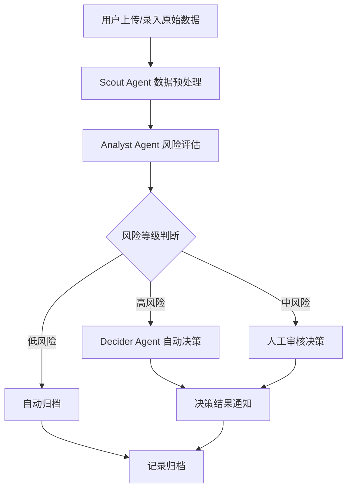
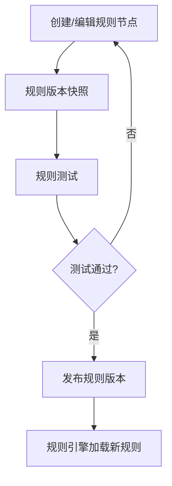

# 供应链风险控制系统 — 产品需求文档

## 1. 产品概述

供应链风险控制系统是一个面向供应链管理人员的智能风险监控与分析平台。系统通过多Agent协作架构，实现对供应链数据的实时采集、智能风险评估、自动化决策建议与规则引擎管理，帮助企业及时发现并应对供应链中的潜在风险。

- **目标用户**：供应链风险分析师、运营决策者、系统管理员
- **核心价值**：将风险识别从人工经验驱动升级为AI驱动的自动化流程，提升响应速度与决策精准度

## 2. 核心功能

### 2.1 用户角色

| 角色 | 权限说明 |
|------|----------|
| 风险分析师 | 查看风险数据、分析结果、创建分析任务 |
| 决策者 | 审核分析结果、执行决策操作、管理规则 |
| 系统管理员 | 用户管理、系统配置、日志审计 |

### 2.2 功能模块

1. **仪表盘首页**：风险总览卡片、实时风险趋势图、最近告警列表、快速操作入口
2. **原始数据管理**：数据录入、数据列表、数据详情、批量导入导出
3. **风险分析中心**：分析结果列表、风险详情视图、风险等级标签、关联分析
4. **决策管理**：决策结果列表、决策审批流程、决策历史追溯、执行状态跟踪
5. **规则引擎**：规则树可视化、规则版本管理、规则测试、规则启用/禁用
6. **系统设置**：LLM模型配置、通知渠道设置、用户与权限管理、操作日志

### 2.3 页面详情

| 页面名称 | 模块名称 | 功能描述 |
|----------|----------|----------|
| 仪表盘 | 风险总览卡片 | 展示高风险/中风险/低风险数量统计，支持点击跳转 |
| 仪表盘 | 实时趋势图 | 折线图展示近7天风险趋势变化 |
| 仪表盘 | 最近告警 | 时间线样式展示最近10条告警记录 |
| 仪表盘 | 快速操作 | 一键创建分析任务、查看待处理决策 |
| 原始数据 | 数据列表 | 表格展示所有原始数据，支持搜索、筛选、排序、分页 |
| 原始数据 | 数据录入 | 模态框表单，支持手动录入与JSON批量导入 |
| 原始数据 | 数据详情 | 侧边抽屉展示完整数据字段与关联分析结果 |
| 风险分析 | 分析结果列表 | 卡片+表格混合布局，展示分析状态与风险等级 |
| 风险分析 | 风险详情 | 全屏详情页，展示风险因子、置信度、Agent执行日志 |
| 决策管理 | 决策列表 | 表格展示决策结果，支持按状态筛选 |
| 决策管理 | 决策审批 | 审批工作流组件，支持通过/驳回/转交 |
| 规则引擎 | 规则树 | 可视化树形结构展示规则节点，支持拖拽编辑 |
| 规则引擎 | 规则版本 | 版本对比视图，高亮差异 |
| 系统设置 | 模型配置 | 表单配置LLM Provider、API Key、模型选择策略 |
| 系统设置 | 用户管理 | 用户CRUD表格，角色分配 |

## 3. 核心流程

### 3.1 风险分析主流程

### 3.2 规则管理流程

## 4. 用户界面设计

### 4.1 设计风格

**设计方向：工业精密风（Industrial Precision）**

| 设计要素 | 规范 |
|----------|------|
| 主色调 | Deep Slate（深岩板色）`#0F172A` 作为背景基调 |
| 强调色 | 风险等级色彩体系：高风险 `#EF4444`（赤红）、中风险 `#F59E0B`（琥珀）、低风险 `#10B981`（翠绿） |
| 辅助色 | Electric Blue `#3B82F6`（主交互色）、Cyber Purple `#8B5CF6`（次要强调） |
| 中性色 | Slate系列：`#1E293B`（卡片背景）、`#334155`（边框）、`#94A3B8`（次要文字）、`#F1F5F9`（主文字） |
| 字体 | 标题：`JetBrains Mono`（等宽技术感）；正文：`Noto Sans SC`（中文优化） |
| 字号层级 | Display: 36px / H1: 28px / H2: 22px / H3: 18px / Body: 14px / Caption: 12px |
| 行高 | 标题 1.2 / 正文 1.6 / 紧凑模式 1.4 |
| 圆角 | 卡片 12px / 按钮 8px / 输入框 6px / 标签 pill |
| 阴影 | 卡片：`0 1px 3px rgba(0,0,0,0.4)`；悬浮：`0 4px 16px rgba(59,130,246,0.15)` |
| 图标 | Lucide Icons（线性风格，2px 描边） |
| 布局 | 侧边导航 + 主内容区，桌面端固定侧栏，移动端抽屉式 |

### 4.2 页面设计概述

| 页面名称 | 模块名称 | UI元素 |
|----------|----------|--------|
| 仪表盘 | 风险总览卡片 | 4列网格，半透明玻璃态卡片，数字跳动动画，渐变进度环 |
| 仪表盘 | 实时趋势图 | Recharts面积图，渐变填充，网格线淡化，悬浮十字准线 |
| 仪表盘 | 最近告警 | 垂直时间线，左侧彩色节点，右侧卡片内容，自动滚动 |
| 原始数据 | 数据表格 | 斑马纹行，悬浮高亮，固定表头，列宽可拖拽调整 |
| 原始数据 | 数据录入 | 模态框，分步表单，JSON编辑器（Monaco Editor），提交动画 |
| 风险分析 | 分析卡片 | 卡片网格，风险等级色条标识，状态脉冲动画，进度条 |
| 决策管理 | 审批流程 | 步骤条组件，当前步骤高亮，已完成打勾，驳回标红 |
| 规则引擎 | 规则树 | 自定义树组件，连接线动画，节点展开/折叠，右键菜单 |
| 系统设置 | 配置表单 | 分组表单，开关切换，保存时顶部Toast提示 |

### 4.3 响应式设计

| 断点 | 布局策略 |
|------|----------|
| Desktop (≥1280px) | 侧边栏展开 240px，内容区最大宽度 1200px，4列网格 |
| Tablet (768px-1279px) | 侧边栏折叠为图标模式 64px，2列网格，表格横向滚动 |
| Mobile (<768px) | 侧边栏隐藏（汉堡菜单），1列网格，卡片全宽，表格转卡片列表 |

### 4.4 动画与微交互

- **页面加载**：骨架屏 → 内容渐显（staggered fade-in，每项延迟 50ms）
- **数字变化**：countUp 动画，缓出曲线，持续 800ms
- **卡片悬浮**：translateY(-4px) + 阴影增强 + 蓝色发光边框，过渡 200ms ease-out
- **路由切换**：内容区淡入淡出 200ms，侧边栏保持
- **通知提示**：Toast 从右上角滑入，4秒后自动消失
- **数据加载**：顶部细进度条（NProgress 风格），蓝色渐变
- **模态框**：缩放+淡入，背景模糊 backdrop-blur
- **风险等级变化**：标签颜色过渡动画 500ms