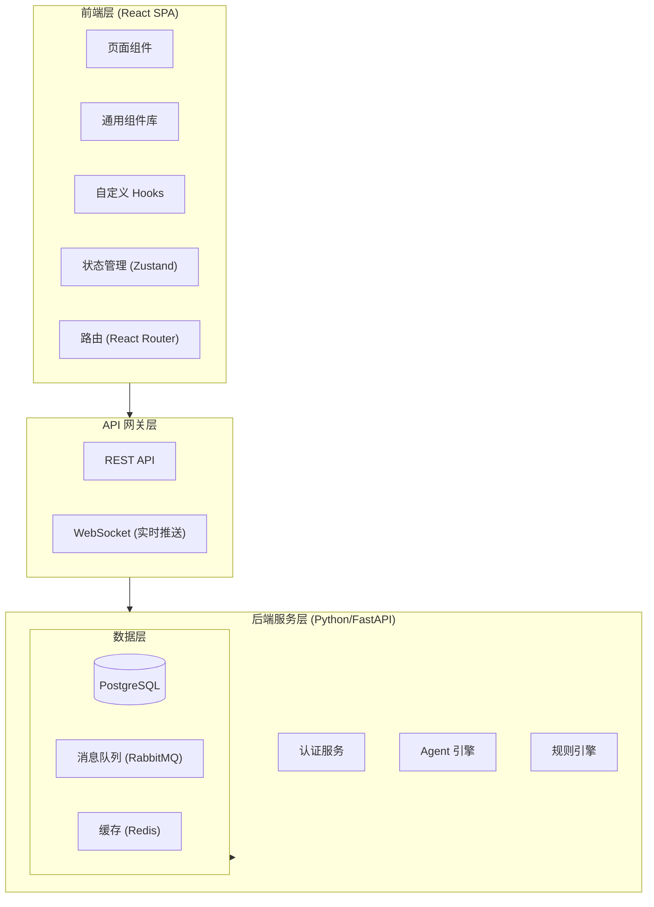

# 供应链风险控制系统 — 技术架构文档

## 1. 架构设计



## 2. 技术选型

| 层级 | 技术 | 版本 | 说明 |
|------|------|------|------|
| 前端框架 | React | 18.x | 函数组件 + Hooks |
| 构建工具 | Vite | 5.x | 快速HMR，ESBuild |
| 样式方案 | Tailwind CSS | 3.x | 原子化CSS |
| 状态管理 | Zustand | 4.x | 轻量级，TypeScript友好 |
| 路由 | React Router | 6.x | SPA路由 |
| 图表 | Recharts | 2.x | React原生图表库 |
| 图标 | Lucide React | latest | 线性图标 |
| 代码编辑器 | Monaco Editor | latest | JSON编辑 |
| 动画 | Framer Motion | 11.x | 声明式动画 |
| HTTP客户端 | Axios | 1.x | 请求拦截/响应处理 |
| 表格 | TanStack Table | 8.x | 无头表格库 |
| 表单 | React Hook Form | 7.x | 高性能表单 |
| 类型检查 | TypeScript | 5.x | 类型安全 |
| 代码规范 | ESLint + Prettier | latest | 代码格式化 |
| 初始化工具 | Vite (`npm create vite`) | 5.x | 项目脚手架 |

## 3. 路由定义

| 路由 | 页面名称 | 权限 | 说明 |
|------|----------|------|------|
| `/` | 重定向到仪表盘 | 所有用户 | 默认跳转 |
| `/dashboard` | 仪表盘 | 所有用户 | 风险总览首页 |
| `/raw-data` | 原始数据管理 | 分析师+ | 数据列表与录入 |
| `/raw-data/:id` | 原始数据详情 | 分析师+ | 单条数据详情 |
| `/analysis` | 风险分析中心 | 分析师+ | 分析结果列表 |
| `/analysis/:id` | 风险分析详情 | 分析师+ | 单条分析详情 |
| `/decisions` | 决策管理 | 决策者+ | 决策结果列表 |
| `/decisions/:id` | 决策审批 | 决策者+ | 审批详情页 |
| `/rules` | 规则引擎 | 管理员 | 规则树编辑 |
| `/rules/versions` | 规则版本管理 | 管理员 | 版本对比 |
| `/settings/llm` | 模型配置 | 管理员 | LLM参数配置 |
| `/settings/users` | 用户管理 | 管理员 | 用户CRUD |
| `/settings/logs` | 操作日志 | 管理员 | 审计日志 |
| `/login` | 登录页 | 未登录 | 认证入口 |

## 4. 项目目录结构

```
frontend/
├── public/
│   └── favicon.svg
├── src/
│   ├── assets/
│   │   └── images/
│   ├── components/
│   │   ├── ui/                  # 基础UI组件
│   │   │   ├── Button.tsx
│   │   │   ├── Card.tsx
│   │   │   ├── Modal.tsx
│   │   │   ├── Toast.tsx
│   │   │   ├── Badge.tsx
│   │   │   ├── Input.tsx
│   │   │   ├── Select.tsx
│   │   │   ├── Table.tsx
│   │   │   ├── Skeleton.tsx
│   │   │   ├── ProgressBar.tsx
│   │   │   └── Tabs.tsx
│   │   ├── layout/              # 布局组件
│   │   │   ├── AppLayout.tsx
│   │   │   ├── Sidebar.tsx
│   │   │   ├── Header.tsx
│   │   │   └── Footer.tsx
│   │   ├── charts/              # 图表组件
│   │   │   ├── RiskTrendChart.tsx
│   │   │   ├── RiskPieChart.tsx
│   │   │   └── RiskGauge.tsx
│   │   ├── business/            # 业务组件
│   │   │   ├── RiskLevelBadge.tsx
│   │   │   ├── AgentLogTimeline.tsx
│   │   │   ├── RuleTree.tsx
│   │   │   ├── ApprovalStepper.tsx
│   │   │   └── DataEntryForm.tsx
│   │   └── common/              # 通用组件
│   │       ├── SearchBar.tsx
│   │       ├── FilterPanel.tsx
│   │       ├── Pagination.tsx
│   │       ├── EmptyState.tsx
│   │       └── ConfirmDialog.tsx
│   ├── hooks/
│   │   ├── useApi.ts
│   │   ├── useWebSocket.ts
│   │   ├── useAuth.ts
│   │   └── useDebounce.ts
│   ├── pages/
│   │   ├── Dashboard.tsx
│   │   ├── RawData/
│   │   │   ├── RawDataList.tsx
│   │   │   └── RawDataDetail.tsx
│   │   ├── Analysis/
│   │   │   ├── AnalysisList.tsx
│   │   │   └── AnalysisDetail.tsx
│   │   ├── Decisions/
│   │   │   ├── DecisionList.tsx
│   │   │   └── DecisionApproval.tsx
│   │   ├── Rules/
│   │   │   ├── RuleEditor.tsx
│   │   │   └── RuleVersions.tsx
│   │   ├── Settings/
│   │   │   ├── LLMConfig.tsx
│   │   │   ├── UserManagement.tsx
│   │   │   └── AuditLogs.tsx
│   │   └── Login.tsx
│   ├── stores/
│   │   ├── authStore.ts
│   │   ├── dashboardStore.ts
│   │   ├── rawDataStore.ts
│   │   ├── analysisStore.ts
│   │   ├── decisionStore.ts
│   │   └── ruleStore.ts
│   ├── services/
│   │   ├── api.ts               # Axios 实例配置
│   │   ├── authService.ts
│   │   ├── dataService.ts
│   │   ├── analysisService.ts
│   │   ├── decisionService.ts
│   │   └── ruleService.ts
│   ├── types/
│   │   ├── api.ts
│   │   ├── models.ts
│   │   └── common.ts
│   ├── utils/
│   │   ├── constants.ts
│   │   ├── formatters.ts
│   │   └── validators.ts
│   ├── App.tsx
│   ├── main.tsx
│   └── index.css
├── index.html
├── package.json
├── tsconfig.json
├── vite.config.ts
├── tailwind.config.js
├── postcss.config.js
└── .eslintrc.cjs
```

## 5. API 接口定义

### 5.1 通用响应格式

```typescript
interface ApiResponse<T> {
  code: number;
  message: string;
  data: T;
  timestamp: string;
}

interface PaginatedData<T> {
  items: T[];
  total: number;
  page: number;
  page_size: number;
  total_pages: number;
}
```

### 5.2 核心接口

| 方法 | 路径 | 说明 |
|------|------|------|
| POST | `/api/auth/login` | 用户登录 |
| POST | `/api/auth/register` | 用户注册 |
| GET | `/api/dashboard/summary` | 仪表盘汇总数据 |
| GET | `/api/dashboard/trends` | 风险趋势数据 |
| GET | `/api/raw-data` | 原始数据列表（分页） |
| POST | `/api/raw-data` | 创建原始数据 |
| GET | `/api/raw-data/:id` | 原始数据详情 |
| DELETE | `/api/raw-data/:id` | 删除原始数据 |
| GET | `/api/analysis` | 分析结果列表 |
| GET | `/api/analysis/:id` | 分析结果详情 |
| POST | `/api/analysis/run` | 触发分析任务 |
| GET | `/api/decisions` | 决策结果列表 |
| PUT | `/api/decisions/:id/approve` | 审批决策 |
| GET | `/api/rules/tree` | 获取规则树 |
| PUT | `/api/rules/tree` | 更新规则树 |
| GET | `/api/rules/versions` | 规则版本列表 |
| GET | `/api/settings/llm` | 获取LLM配置 |
| PUT | `/api/settings/llm` | 更新LLM配置 |
| GET | `/api/settings/models` | 获取可用模型列表 |
| GET | `/api/users` | 用户列表 |
| POST | `/api/users` | 创建用户 |
| GET | `/api/logs` | 操作日志列表 |
| WS | `/ws/dashboard` | 仪表盘实时推送 |

## 6. 数据模型（前端TypeScript类型）

```typescript
// 风险等级枚举
type RiskLevel = 'critical' | 'high' | 'medium' | 'low' | 'none';

// 原始数据
interface RawData {
  id: string;
  request_id: string;
  source: string;
  data_type: string;
  content: Record<string, unknown>;
  status: 'pending' | 'processing' | 'completed' | 'failed';
  created_at: string;
  updated_at: string;
}

// 分析结果
interface AnalysisResult {
  id: string;
  request_id: string;
  raw_data_id: string;
  risk_level: RiskLevel;
  risk_score: number;
  risk_factors: RiskFactor[];
  confidence: number;
  agent_log: AgentExecutionLog[];
  status: 'pending' | 'running' | 'completed' | 'failed';
  created_at: string;
  completed_at: string | null;
}

interface RiskFactor {
  name: string;
  severity: RiskLevel;
  description: string;
  score: number;
}

// 决策结果
interface DecisionResult {
  id: string;
  request_id: string;
  analysis_result_id: string;
  decision_type: 'auto_approved' | 'auto_rejected' | 'manual_review';
  status: 'pending' | 'approved' | 'rejected' | 'escalated';
  reason: string;
  rule_node_id: string | null;
  reviewer_id: string | null;
  created_at: string;
  resolved_at: string | null;
}

// 规则节点
interface RuleNode {
  id: string;
  name: string;
  condition: string;
  action: string;
  priority: number;
  enabled: boolean;
  children: RuleNode[];
}

// Agent执行日志
interface AgentExecutionLog {
  id: string;
  agent_name: string;
  action: string;
  input: Record<string, unknown>;
  output: Record<string, unknown>;
  duration_ms: number;
  status: 'success' | 'error';
  error_message: string | null;
  created_at: string;
}

// 用户
interface User {
  id: string;
  username: string;
  email: string;
  role: 'analyst' | 'decider' | 'admin';
  is_active: boolean;
  created_at: string;
}
```